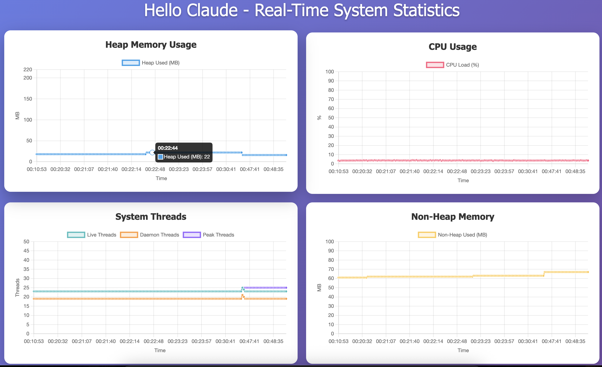

# Claude Hello World



**This project is a quick demo created to test the capabilities of Cursor, with zero prior experience using the tool.**

A full-stack JVM monitoring and visualization solution for modern Java applications.

## Overview

**Hello Claude** is a demonstration project for JVM and application metrics monitoring, featuring:
- **Spring Boot 3.4.5** backend (Java 21)
- **Angular 17+** frontend with Chart.js
- Real-time REST API for JVM stats
- Responsive, themeable dashboard
- Native build support (GraalVM)

---

## Project Structure

```
claude-hello-world/
├── hello-claude/          # Spring Boot backend
│   ├── src/main/java/com/ejemplo/helloclaude/  # Java source (current package)
│   ├── pom.xml
│   ├── build.sh
│   └── README.md
├── hello-claude-web/      # Angular frontend
│   ├── src/app/
│   ├── package.json
│   └── README.md
└── README.md              # This file
```

---

## Quick Start

### Backend (Spring Boot)
```bash
cd hello-claude
./build.sh run
```
- API: [http://localhost:8080/api/stats](http://localhost:8080/api/stats)
- Swagger UI: [http://localhost:8080/swagger-ui.html](http://localhost:8080/swagger-ui.html)

### Frontend (Angular)
```bash
cd hello-claude-web
npm install
npm start
```
- Dashboard: [http://localhost:4200](http://localhost:4200)

---

## Features
- JVM heap/non-heap memory, CPU, thread stats
- 1-hour historical timeline, live polling
- Multiple charts, dark/light themes
- Native image build (GraalVM)

---

## Requirements
- Java 21
- Maven 3.6+
- Node.js 18+
- (Optional) GraalVM for native builds

---

## License
This project is for educational and demonstration purposes.

---

_Última edición: subida de prueba a develop._ 